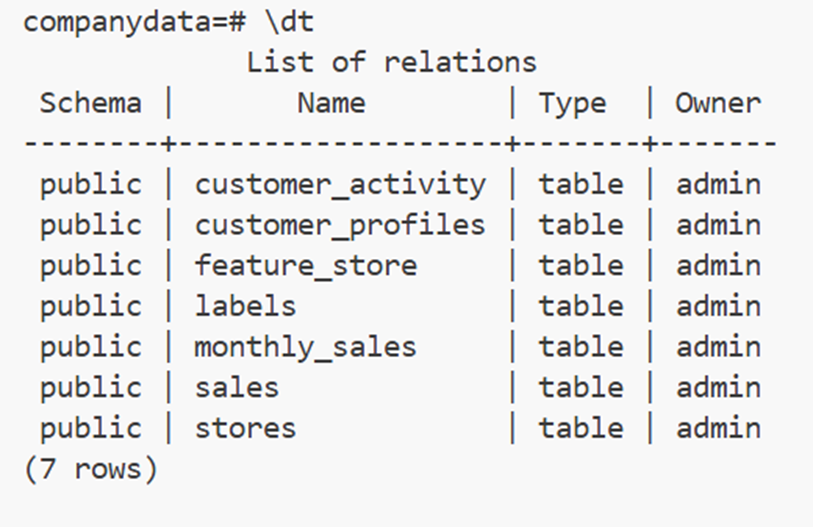
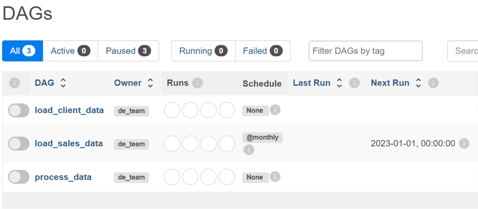
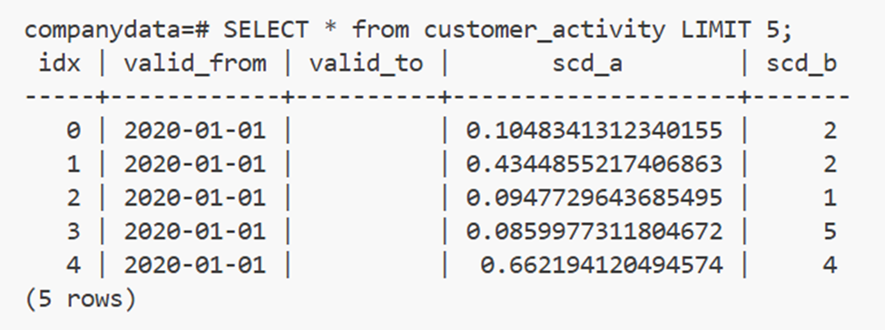
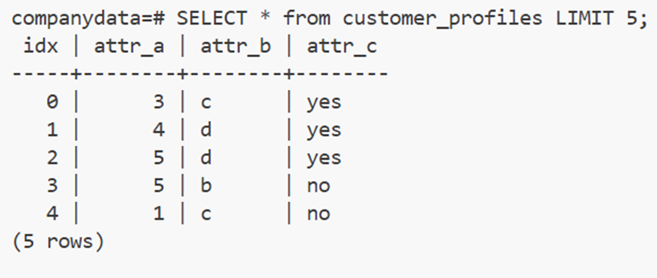
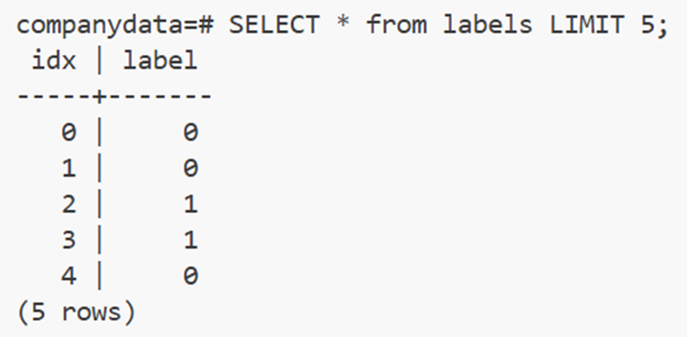
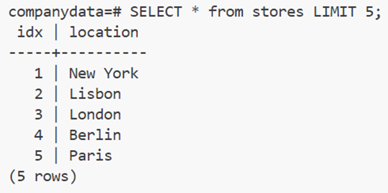
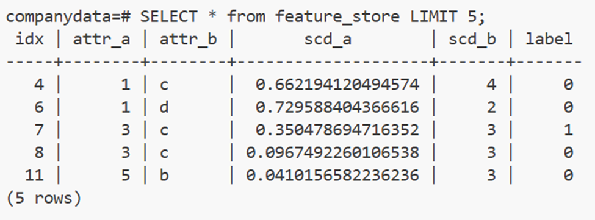

# Technical Assessment Solution

## Project Overview

This document describes my implementation of the technical assessment, which involves building a complete system with data engineering, data science, machine learning and deployment components.

## Implemented Modules

### Data Engineering Module

## Overview

This module implements a data engineering solution for processing and storing client data. It includes:

1. A PostgreSQL database with user roles and permissions
2. An Airflow instance for workflow orchestration
3. ETL pipelines to process data from S3 and create a feature store

#### PostgreSQL Database

- Database name: `companydata`
- Admin user with full access
- DS user with read-only access
- MLE user with full access to the public schema
- Created initialization script in the `db_admin` directory for initial table creation

#### Airflow for Workflow Orchestration

- Deployed Airflow UI accessible at port 8082
- Configured with username `airflow` and password `airflow`
- Set up to load custom DAGs from the `dags` directory
- Connected to PostgreSQL for workflow state management
- Configured with access to S3 for data ingestion

#### ETL Workflows Implementation

Implemented three main Airflow DAGs:

1. `load_client_data` - One-off workflow that loads customer profiles, activity data, and labels from S3. Needs to be run manually
2. `load_sales_data` - Monthly workflow that loads and aggregates sales data
3. `process_data` - Creates the feature store by joining customer data tables. Run automatically afer `load_client_data` finishes

#### Directory Structure

- `dags/` - Contains Airflow DAGs for data processing
- `docker/` - Dockerfile and requirements for Airflow
- `plugins/` - Custom Airflow plugins and helpers
- `db_admin/` - Database initialization script

## Data Storage

PostgreSQL data is stored locally in the module's directory structure:

- PostgreSQL data: `modules/de/data/postgres/`

### Data Science Module Task

Implemented the "Add a new function to the `data_science` package to fetch the data from the sales table" task:

- Added a `get_sales_data()` function to the `fetch_data.py` file
- The function connects to the database and retrieves all sales data
- Used the existing connection string pattern for consistency

### Machine Learning Engineering Module Task

Implemented the "Add logging to the `MLEModel` class" task:

- Added Python's logging module to the MLEModel class
- Configured logging with appropriate format and level
- Added log entries to all key methods (load, save, fit, predict)
- Enhanced error handling in the log_to_storage method
- Log messages include relevant information (args, shapes, client ids)

## Deployment Module (To Be Completed)

### CI/CD Implementation

Implemented a CI/CD pipeline using GitHub Actions to ensure code quality:

- Created a GitHub Actions workflow that runs automatically on pull requests to main branch
- Implemented automatic code formatting with Black to ensure consistent code style
- Set up automatic commit of formatted code back to the repository
- Ensured proper repository permissions for GitHub Actions


### API Implementation

Implemented a simple Flask-based API that serves model predictions through HTTP:

- Created a RESTful API endpoint at `/predict` that accepts POST requests
- Implemented proper model loading from the DS module's models directory
- Added input validation and error handling to ensure robust operation
- Structured the API to return prediction labels in JSON format

## Running the Project

### Setup and Starting Services

The project is configured to run as part of the docker-compose setup. Start all services with:

```bash
# Start all services in detached mode
docker-compose up -d
```

### Testing the Data Engineering Module

#### 1. Verify PostgreSQL Database

Confirm that the PostgreSQL database is running and properly configured:

```bash
# Connect to PostgreSQL using the admin user
docker exec -it postgres psql -U admin -d companydata

# List all tables in the public schema
\dt public.*


# Exit PostgreSQL
\q
```

#### 2. Access Airflow UI

Access the Airflow UI to check and trigger workflows:

- Open your browser and navigate to `http://localhost:8082`
- Login with username `airflow` and password `airflow`
- Verify that all DAGs are listed in the UI:
  - `load_client_data`
  - `load_sales_data`
  - `process_data`



#### 3. Run ETL Workflows

Execute the workflows in the proper order in the Airflow UI:

1. Navigate to the DAGs list
2. Turn the 3 DAGs on
3. Run `load_client_data` manually
4. Verify that the 3 DAGs run successfully

#### 4. Verify Data Processing Results

Check that the feature store was properly created:

```bash
# Connect to PostgreSQL
docker exec -it postgres psql -U admin -d companydata

# Check the feature store table
SELECT COUNT(*) FROM public.feature_store;
SELECT * FROM public.feature_store LIMIT 5;

# Exit PostgreSQL
\q
```










#### 5. Test Data Access with Different Users

Verify that user permissions are correctly set:

```bash
# Connect as DS user (read-only)
docker exec -it postgres psql -U ds_user -d companydata

# Exit and connect as MLE user
\q
docker exec -it postgres psql -U mle_user -d companydata
```

## Implementation Timeline

- Friday was used to do an initial review of requirements

- Saturday started with setting up local development environment, configuring Docker and environment variables, database schema and user setup. This took around 1 hour
- Airflow configuration, ETL workflows implementation and testing and validation. This took around 2 hours
- Model training was giving me some problems. First with pandas, which I was able to solve, but then new problems showed up. I spent the rest of the day trying to solve this, but wasn't successfull


- Since I wasn't able to solve the issue the day before, Sunday I gave it another try. Wasn't successfull and decided to continue the assessment even without model training working. I tried to solve this issue for like 2 hours more
- Implemented DS module task: Added get_sales_data() function and MLE module task: Added logging to MLEModel class. This took around 1 hour
- Implemented CI/CD with GitHub Actions for code formatting with black. This took around 30 minutes


- Both Saturday and Sunday I was updating SOLUTION.md as I was developing the project. Sunday at the end of the day I finished it and made it more structured

